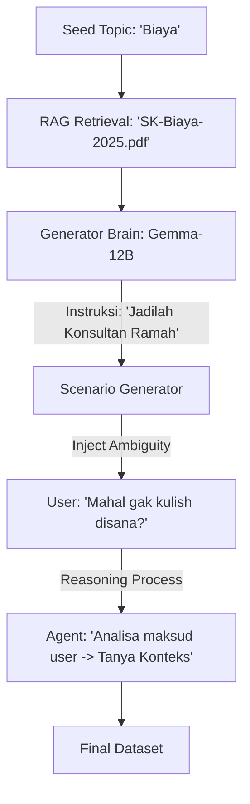

# PROJECT BLUEPRINT: UNSIQ Synthetic Dataset Pipeline

> **Version**: 2.0 (Refined Master Plan)
> **Target**: Gemma-3-1B Fine-tuning (QLoRA)
> **Focus**: Knowledge Injection + Reasoning Preservation

---

## 1. Executive Summary (The "Goal")

**Masalah Saat Ini**:
Dataset lama terlalu singkat dan _Robotic_.

- _User_: "Biaya teknik?"
- _Bot_: "5 Juta." (Terlalu pendek, tanpa konteks).

**Tujuan Akhir (The New Standard)**:
Kita ingin mencetak dataset **Multi-Turn Conversation** di mana bot berperilaku seperti **Konsultan Pendidikan**, bukan mesin pencari.

- **Verbose & Explanatory**: Jawaban minimal 2-3 kalimat (>20 kata).
- **Inquisitive (Balik Bertanya)**: Jika pertanyaan user ambigu, bot **WAJIB** bertanya balik untuk klarifikasi sebelum menjawab.
- **Reasoning-Driven**: Bot tidak sekadar _fetch_ data, tapi _menjelaskan_ datanya.

**Contoh Target Output**:

> **User**: "Berapa biaya teknik?"
> **Bot**: "Untuk Fakultas Teknik di UNSIQ, biayanya tergantung pada program studi yang Anda ambil. Apakah yang Anda maksud Teknik Informatika atau Teknik Sipil? Selain itu, apakah Anda berencana tinggal di asrama (pesantren)?"
> **User**: "Teknik Informatika, tidak asrama."
> **Bot**: "Baik. Untuk S1 Teknik Informatika jalur reguler (non-pesantren), biaya SPP per semesternya adalah Rp X.XXX.XXX. Namun, ada rincian biaya registrasi awal sebesar Rp Y.XXX.XXX. Apakah Anda ingin saya rincikan total biaya masuk pertamanya?"

---

## 2. Technical Architecture (The "Machine")

### "Reasoning Injection" Pipeline

Kita menggunakan teknik **"Knowledge-Augmented Reasoning Distillation"**.
Artinya: Kita meminjam "Otak" Gemma-12B (Teacher) untuk mengajarkan Gemma-1B (Student) bagaimana cara **bernalar menggunakan Data UNSIQ**.



---

## 3. The Core Strategy (Deep Dive)

### A. Clarification-First Strategy (Anti-Halusinasi)

Di `Tier 1` dan `Tier 2`, kita melarang bot langsung menjawab jika pertanyaan user terlalu umum.

- **Rule**: Jika input user < 5 kata atau ambigu ("Biaya berapa?", "Syaratnya apa?"), Bot **DILARANG** memberikan angka.
- **Action**: Bot harus memberikan _Clarifying Question_ ("Biaya untuk prodi apa?", "Syarat jalur prestasi atau reguler?").
- **Tujuan**: Melatih Gemma-1B untuk **TIDAK SOTOY** (Overconfident) dan lebih berhati-hati.

### B. "Light CoT" (Reasoning Traces)

Kita tetap menyuntikkan _Reasoning_, tapi tidak perlu seberat matematika (Deep CoT). Cukup **"Light CoT"** untuk decision making.

- **Format Data**:
  ```json
  {
    "role": "model",
    "thought": "User bertanya soal biaya tapi tidak sebut prodi. Saya harus tanya prodi dulu untuk memastikan angka yang akurat.",
    "content": "Bisa dibantu infonya kak, kakak tertarik dengan Prodi apa ya? Soalnya biaya Tiap fakultas berbeda-beda..."
  }
  ```
- **Manfaat**: Saat fine-tuning, Gemma-1B belajar bahwa _sebelum menjawab, dia harus menganalisa kelengkapan info dulu_.

### C. Verbosity Control (Minimal 15 Words)

Kita set _hard constraint_ pada Generator Gemma-12B Teacher.

- **Instruksi**: "Jangan pernah menjawab dengan satu kalimat pendek. Jelaskan konteksnya, berikan contoh, atau tawarkan bantuan tambahan."
- **Hasil**: Jawaban yang "Berisi" dan terasa manusiawi (Konsultatif).

---

## 4. Implementation Details (The "How-To")

### Modifikasi Script Generator (`llm_multiturn_generator.py`)

Kita akan update Logic Generator agar memiliki mode **"Ambiguity Injector"**.

1.  **Skenario "Ambigu"**:
    - Input: "Biayanya?"
    - Expected Output: Bot bertanya balik (Clarification).
2.  **Skenario "Lengkap"**:
    - Input: "Biaya TI S1 Reguler berapa kak?"
    - Expected Output: Bot menjawab lengkap + Breakdown rincian + Penawaran (Reasoning).

### Optimization Strategy (Batching)

Agar proses generate 1.000 percakapan kualitas tinggi ini cepat:

- **Async Batching**: Kita kirim 50 skenario sekaligus ke Gemma-12B.
- **Validation**: Jika output < 10 kata, **REJECT** dan regenerate ulang (Auto-retry).

---

## 5. Evaluation Metrics (Quality Gate)

Kita tidak hanya mengecek validitas JSON. Kita menilai "Kecerdasan"-nya.

| Metrik                 | Target     | Cara Ukur                                                                   |
| :--------------------- | :--------- | :-------------------------------------------------------------------------- |
| **Reasoning Score**    | > 4.0 / 5  | LLM Judge menilai: "Apakah bot melakukan analisa sebelum menjawab?"         |
| **Clarification Rate** | > 30%      | 30% dari total data harus mengandung percakapan di mana bot bertanya balik. |
| **Avg. Length**        | > 40 words | Rata-rata panjang jawaban bot per turn.                                     |
| **Factuality**         | 99%        | Tidak boleh ada angka biaya yang salah (Divalidasi RAG).                    |

---

## 6. Next Steps (Execution Plan)

1.  **Refactor Prompt Generator**: Update prompt `src/llm_multiturn_generator.py` agar lebih "Cerewet" (Verbose) dan suka bertanya balik.
2.  **Implementasi Batching**: Update `generate_synthetic_main.py` agar support Async.
3.  **Run Pilot**: Generate 50 data dulu -> User Review (Anda cek apakah cukup panjang).
4.  **Full Run 1.000 Data**.
