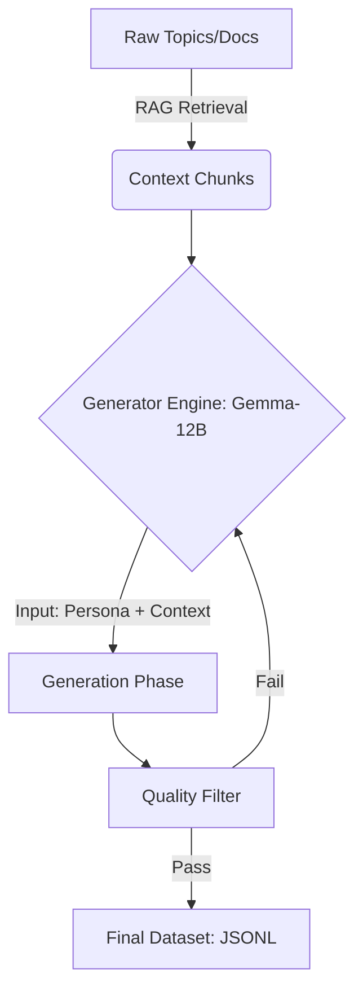

# Synthetic Data Generation Strategy: "Teacher-Student RAG Distillation"

## Executive Summary

**Objective**: Generate **1,000 high-quality multi-turn conversation datasets** for fine-tuning **Gemma-3-1B (Student)** using **Gemma-3-12B + RAG (Teacher)**.
**Infrastructure**: vLLM on NVIDIA A100 (80GB).
**Methodology**: **Evol-Instruct** adaptation for RAG (Complexity Evolution + Diversity) and **Persona Injection**.

---

## 1. Architecture: The Factory Pipeline



### Components

1.  **Teacher Model**: Gemma-3-12B-Instruct (loaded via vLLM).
2.  **Context Source**: Your existing RAG Vector Store (UNSIQ Documents).
3.  **Generator Logic**: A Python script employing **Evol-Instruct** strategies.

---

## 2. Core Strategy: "Evol-Instruct" for RAG

We will not just "ask and answer". We will **evolve** the complexity to make the 1B model smarter.

### A. Diversity Distribution (The 1000 Mix)

We will split the 1000 datasets into 3 difficulty tiers to prevent the model from becoming "lazy".

| Complexity Tier        | % Allocation | Count | Description                                                                                                                               |
| :--------------------- | :----------- | :---- | :---------------------------------------------------------------------------------------------------------------------------------------- |
| **Tier 1: Direct**     | 40%          | 400   | Simple FAQ. Direct questions, direct answers. (e.g., "Berapa biaya S1?")                                                                  |
| **Tier 2: Reasoning**  | 40%          | 400   | Multi-step logic. User asks "A", logic requires finding "B" then "C". (e.g., "Kalau saya dari pesantren dan mau hemat, ambil prodi apa?") |
| **Tier 3: Edge Cases** | 20%          | 200   | Hard/Vague inputs. User is confused, misspelled, or implied intent. (e.g., "Katanya ada diskon buat yang hapal quran? Itu gimna?")        |

### B. Persona Injection (The "Humanizer")

To prevent robotic data, we inject specific personas into the **User** prompt during generation.

- **The Anxious Parent**: Worried about safety, costs, and dorms.
- **The Ambitious Student**: Asks about accreditation, careers, and exchange programs.
- **The Confused Transfer**: Complex questions about SKS conversion.
- **The Local Villager**: Uses simple/regional language (indo/jawa mix if capable).

### C. Anti-Forgetting & Reasoning Preservation (The "Brain Gym")

To prevent the model from becoming "dumb" (catastrophic forgetting) due to simple data, we use 3 techniques:

1.  **Implicit CoT (Chain-of-Thought)**:
    - Even for short questions (e.g., "Berapa biaya?"), the _Training Data_ will include a hidden thought process.
    - _Format_: `User: Q -> Model: (Thought: Context X states Y...) Answer`.
    - _Why_: Forces the 1B model to "think" before fetching, verifying the reasoning pathway.
2.  **Hard Negatives (The Trap)**:
    - Inject questions where the answer is _NOT_ in the context.
    - _Model Task_: Explicitly state "Information not found in UNSIQ documents", refusing to hallucinate.
    - _Why_: Teaches discernment, not just rote retrieval.
3.  **Complexity Camouflage**:
    - Short questions that require multi-source lookup.
    - _Example_: "Mana lebih murah, TI atau Mesin?" (Requires retrieving 2 distinct prices + comparison).

---

## 3. Implementation Steps

### Step 1: The "Seed" Generation

Instead of using random topics, we iterate through your raw categories (`biaya`, `alur`, `beasiswa`).

- **Equation**: 12 Categories × ~85 Conversations/Category = 1,020 Total.

### Step 2: The Generator Prompt (Template)

The prompt sent to Gemma-12B must be strict.

**System Prompt for Teacher (12B):**

> "You are an expert Data Synthetic Generator. Your task is to create a realistic, multi-turn conversation between a User and a CS Agent based _strictly_ on the provided Context. You MUST include internal thought traces for the Agent."

**User Prompt for Teacher (12B):**

```text
CONTEXT:
{retrieved_chunk_from_rag}

TASK:
Create a chat history (JSON format) with {turn_count} turns.
Persona: {selected_persona}
Complexity: {selected_complexity}
Technique: {Implicit_CoT_or_Hard_Negative}

REQUIREMENTS:
1. User asks questions naturally.
2. Agent FIRST generates a 'thought' field (reasoning), THEN 'content' (reply).
3. If {Technique} == Hard_Negative, User asks something out-of-scope, Agent politely refuses using reasoning.
4. Output JSON: [{"role": "user", "content": "..."}, {"role": "model", "thought": "...", "content": "..."}]
```

_(Note: We can strip the 'thought' field later for inference-only models, or keep it for reasoning-heavy training)_

### Step 3: Evolution Logic (The Script)

1.  **Pick Category** (e.g., "Beasiswa").
2.  **Retrieve Context** from RAG (Top-k=3 chunks).
3.  **Select Complexity** (Weighted Random: 40/40/20).
4.  **Select Persona** (Random).
5.  **Generate & Validate**:
    - Check if output is valid JSON.
    - Check logical consistency (Student 12B usually good, but simple regex checks help).

---

## 4. Technical Stack (A100 Optimized)

### vLLM Server (Fast Inference)

Run the 12B model as an API server for maximum throughput on the A100.

```bash
python -m vllm.entrypoints.openai.api_server \
    --model google/gemma-3-12b-it \
    --gpu-memory-utilization 0.9 \
    --dtype bfloat16
```

### Generator Script (Python)

- **AsyncIO**: Generate 10-20 conversations in parallel (A100 is fast!).
- **Backoff**: Retry if 12B hallucinates format.
- **Output**: Stream heavily to `synthetic_raw.jsonl`.

## 5. Success Metrics

How do we know if this succeeds?

1.  **Perplexity (PPL)**: Low complexity on holdout real data.
2.  **RAG Accuracy**: The 1B student, when fine-tuned, should answer questions it _never saw_ in training but has context for.
3.  **Tone Match**: Does it sound like the personas we injected?

---

## Next Action

I can write the **Generator Script (Python)** for you now. It will:

1.  Connect to your vLLM endpoint.
2.  Loop through your `dataset_*.json` to get "Seeds".
3.  Generate the 1000 datasets automatically.
